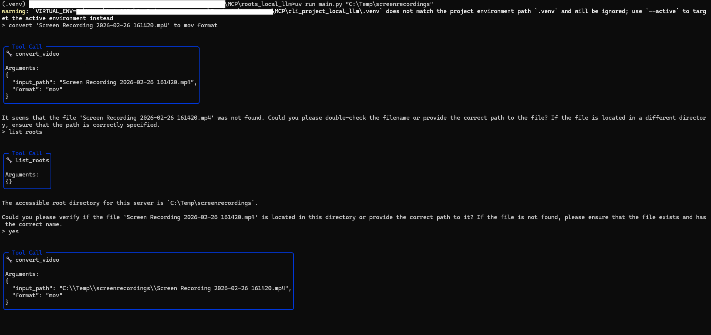

# VidsMCP — Local LLM CLI with MCP File & Video Tools

A command-line chat app that connects a **local LLM running via Ollama** (Qwen, Llama, etc.) to an MCP server that can browse directories and convert videos. No Anthropic or OpenAI API keys required — everything runs on your machine.

## How it works

```
You (CLI) → Openai client (Ollama) → MCP Server → your file system
```

1. You type a message in the terminal
2. The LLM decides whether to call a tool or reply directly
3. If a tool is called, the MCP server executes it against your allowed root directories
4. The result is fed back to the LLM, which forms a final response

---

## Prerequisites

- Python 3.10+
- [uv](https://github.com/astral-sh/uv) — fast Python package manager
- [Ollama](https://ollama.com) running locally with a model pulled
- FFmpeg — only needed for video conversion

### Install Ollama and pull a model

```bash
# Install Ollama (macOS)
brew install ollama

# Pull a model (pick one)
ollama pull qwen2.5:latest
ollama pull llama3.2:latest
```

### Install FFmpeg (optional, for video conversion)

```bash
brew install ffmpeg       # macOS
sudo apt install ffmpeg   # Ubuntu/Debian
choco install ffmpeg      # windows via choco
winget install ffmpeg     # windows 11
```

---

## Setup

### 1. Clone and install dependencies

```bash
uv sync
```

### 2. Configure environment

```bash
cp .env.example .env
```

Edit `.env`:

```env
# Model name exactly as shown in `ollama list`
LLM_MODEL=qwen2.5:latest

# Ollama's OpenAI-compatible endpoint (default shown)
LOCAL_LLM_BASE_URL=http://localhost:11434/v1
```

### 3. Start Ollama

```bash
ollama serve
```

### 4. Run

Pass one or more directories the LLM is allowed to access:

```bash
uv run main.py <root1> [root2] ...
```

Examples:

```bash
# Single directory
uv run main.py /path/to/videos

# Multiple directories
uv run main.py ~/Videos ~/Downloads/media

# Current directory
uv run main.py .
```

---

## Available tools

The MCP server exposes three tools to the LLM:

| Tool | Description |
|---|---|
| `list_roots` | List all root directories the server has access to |
| `read_dir` | List contents of a directory (must be within a root) |
| `convert_video` | Convert an MP4 to another format using FFmpeg |

You don't call tools directly — just describe what you want and the LLM invokes them:

```
> what directories do you have access to?
> list the files in /path/to/videos
> convert /path/to/videos/clip.mp4 to mov
```

### Supported video output formats

`avi` · `mov` · `webm` · `mkv` · `gif`

GIF conversion uses optimised settings (15fps, 480px wide, lanczos scaling). All other formats use H.264 + AAC at medium quality (CRF 23).

---

## Project structure

```
.
├── main.py                  # Entry point — wires Ollama client, MCP client, CLI
├── mcp_server.py            # FastMCP server exposing list_roots, read_dir, convert_video
├── mcp_client.py            # MCP client — connects to the server over stdio
└── core/
    ├── openai_client.py     # Ollama/OpenAI client with Anthropic-compatible interface
    ├── chat.py              # Chat loop — handles tool call cycles
    ├── cli_chat.py          # CLI-specific chat (prompt support)
    ├── cli.py               # Terminal UI — streaming output, tool call display
    ├── tools.py             # ToolManager — discovers and executes MCP tools
    ├── video_converter.py   # FFmpeg wrapper
    └── utils.py             # file:// URL helpers
```

---

## Security

The MCP server enforces **root-based access control** — it will refuse any tool call that targets a path outside the roots you passed on the command line. The LLM cannot read or modify files outside those directories.

---

## Switching models

Change `LLM_MODEL` in `.env` to any model available in your Ollama instance:

```bash
ollama list          # see what's installed
ollama pull llama3.2 # pull a new one
```

Then update `.env`:

```env
LLM_MODEL=llama3.2:latest
```

Tool calling support varies by model. **Qwen2.5** and **Llama 3.2+** have reliable tool use. Smaller or older models may not follow tool call instructions consistently.

## Demo


*MCP Chat running with llama3.2 via Ollama on Windows*
